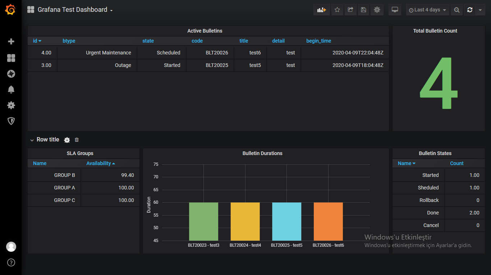

## DESCRIPTION

This is a database application using Grafana observability platform. It is possible to visualize complex dashboards.

## FIRST

* Configure mssql db and launch sql commands
* Download and setup the grafana from https://grafana.com/grafana/download
* Start this url http://localhost:3000/


## SECOND

```
	-- Get Datas
	-- exec dbo.sp_get_data
	select * from bulletin
	select * from CategorizedView

	-- Get Bulletins
	select * from dbo.get_bulletins_with_contacts('2020-04-09 13:04:48','2020-04-10 17:04:48.000','CONTACT A')
	select * from dbo.get_bulletins_with_groups('2020-04-09 13:04:48','2020-04-10 17:04:48.000','GROUP B')
	select * from dbo.get_bulletins_with_items('2020-04-09 13:04:48','2020-04-10 17:04:48.000','TAG B2')

	-- Get Reports
	select * from [dbo].[get_contact_sla]('2020-04-09 13:04:48','2020-04-10 13:04:48.000')
	select * from [dbo].[get_group_sla]('2020-04-09 13:04:48','2020-04-10 13:04:48.000')
	select * from [dbo].[get_item_sla]('2020-04-09 13:04:48','2020-04-10 13:04:48.000')

	-- Set Scheduled Jobs
	exec dbo.sp_export_csv '2020-04-09 13:04:48','2020-04-10 13:04:48'
	exec dbo.sp_send_mail 'D:\groupsla_202004091304480000.csv','D:\itemsla_202004091304480000.csv','D:\contactsla_202004091304480000.csv'


```


## THIRD

* services.msc start sql browser start
* open udp 1434 in firewall
* sql configuration open netwok configuration enable tcp/ip
* in grafana add sql datasource

```
	select id,btype,[state],code,title,detail,begin_time from dbo.info_bulletin_table();

	select [Name],[Count] from dbo.info_bulletin_status();

	select sum([Count]) as Total from dbo.info_bulletin_status();

	select * from [dbo].[info_group_sla_this_week]();

	select [time],[metric],[value] from dbo.info_bulletin_time_series() order by [time] asc;

```



